# AI Assisted Translations

This module adds AI-assisted translation capabilities to Jahia content (pages and content nodes), with support for:

- DeepL translation
- OpenAI translation
- GraphQL translation suggestions and mutations
- CSV-based glossaries managed inside Jahia

## Installation

1. In Jahia, go to `Administration -> Server settings -> System components -> Modules`.
2. Upload `ai-assisted-translations-X.X.X.jar`.
3. Ensure the module is started.
4. Activate the module on the websites where you want to use it.

## Runtime behavior

- The module can expose one translation provider at a time through `TranslatorService`.
- If both API keys are configured, OpenAI has priority over DeepL in current service activation logic.
- From jContent, right click on `jnt:page` or `jnt:content` and use the translation menu:
  - translate to all site languages
  - translate to a specific target language

## JContent usage

This module registers two UI actions in `src/javascript/RequestAssistedTranslation/register.jsx`.

### 1) Content-level action (Translate screen / Edit screen)

Registered action: `requestTranslationAiAssistedForOneContent`.

Targets:

- `translate/header/3dots:5.5`
- `content-editor/header/3dots:5.5`

Component: `RequestAssistedTranslationComponent`.

How it behaves:

- Available when:
  - module is installed on the site,
  - site has more than one language,
  - current node is editable (not locked),
  - a source language can be determined.
- Opens the translation dialog for the current content item.
- Source language:
  - side-by-side language when available,
  - otherwise first language in the node translation languages list.
- Target language is the current editor language.
- For content editing flow, it calls GraphQL `translationSuggestions` and injects suggested values into the current form fields.

### 2) Page / main resource action (tree-level)

Registered action: `requestTranslationAiAssistedForOnePage`.

Target:

- `headerPrimaryActions:15`

Component: `RequestAssistedTranslationForTreeComponent`.

How it behaves:

- Designed for page/main resource level translation from the page header action area.
- Available when:
  - module is installed on the site,
  - current node has write permission,
  - current node is not locked.
- Opens the same translation dialog but for tree-level/page-level operation.
- Uses site default language as source language and current UI/editor language as target language.
- The dialog allows source language selection from site languages and then triggers the translation mutation flow.

Notes:

- Both actions use the same dialog (`RequestAssistedTranslation`) and differ mainly by context and target location in the UI.
- Suggested translations (content-level) update form values in-place; mutation-based translation is used for persist operations.

### Visual walkthrough (action -> dialog -> result)

The screenshots below are grouped by flow phase and context.

#### Content flow - Edit screen

Action:

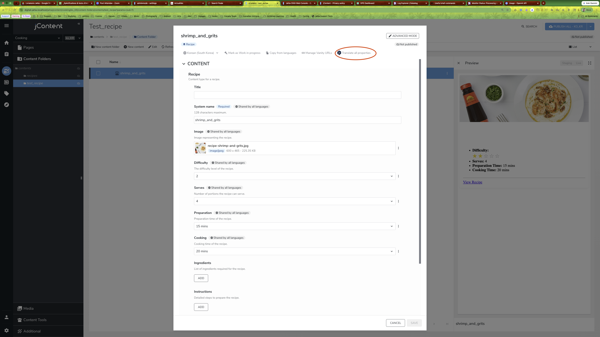

Dialog step 1:

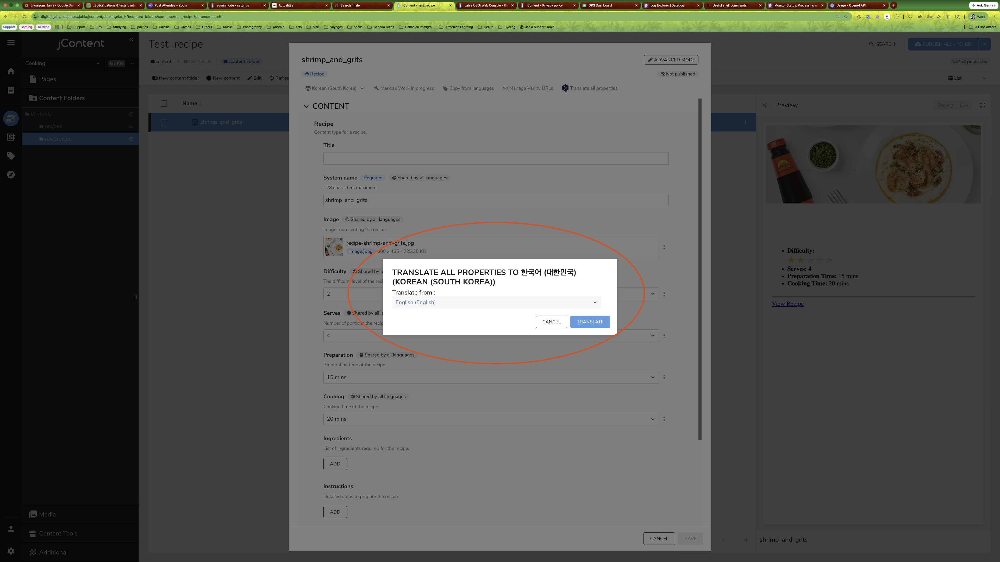

Dialog step 2 (language dropdown):

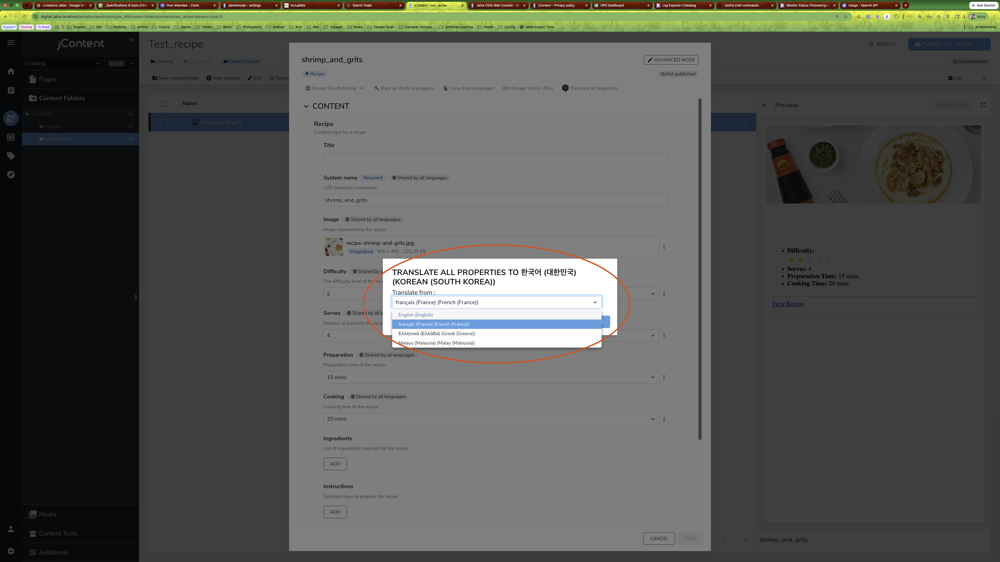

Result:

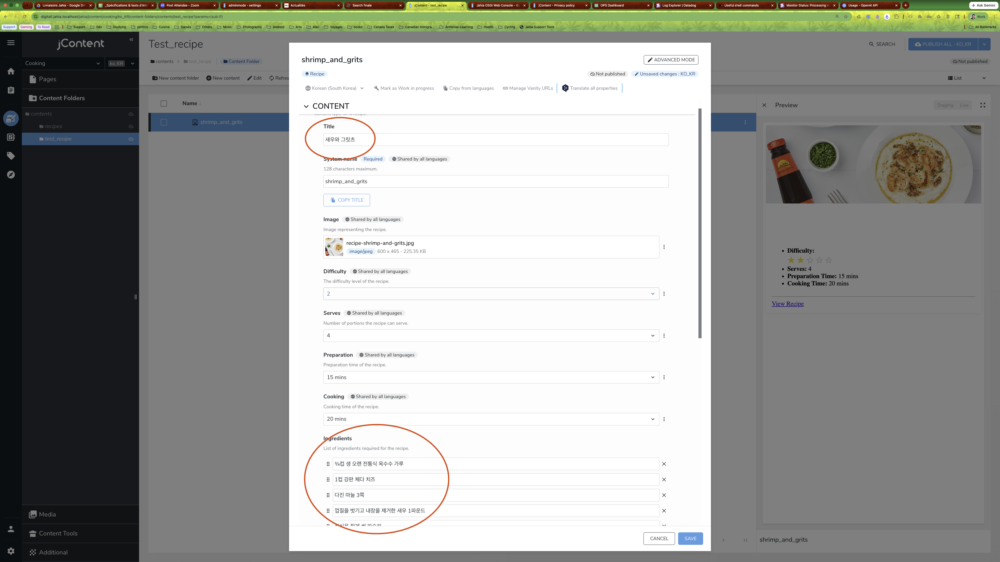

#### Content flow - Translate screen

Action:

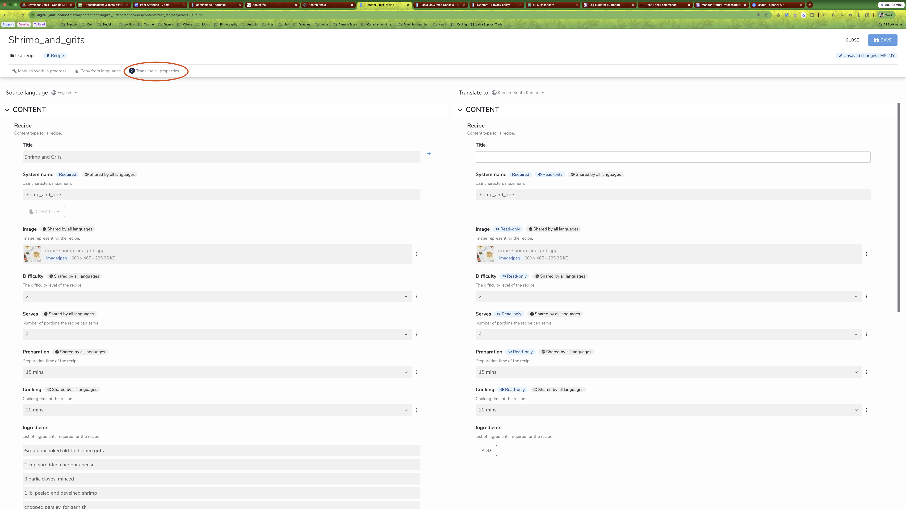

Dialog:

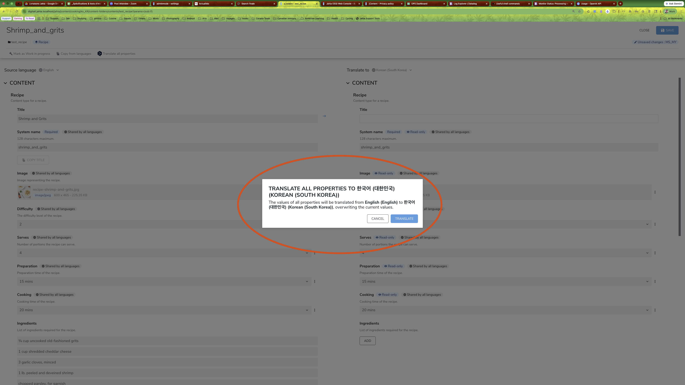

Result:

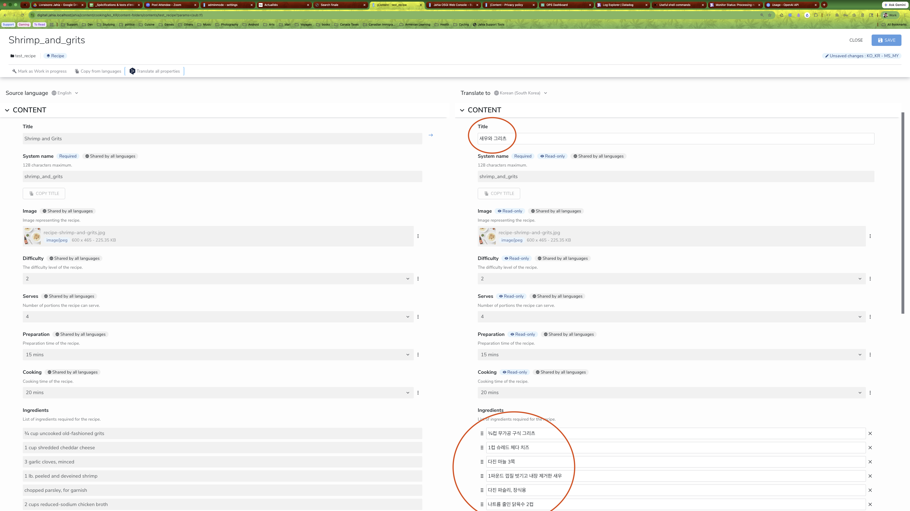

#### Main resource / page flow (tree-level)

Action:

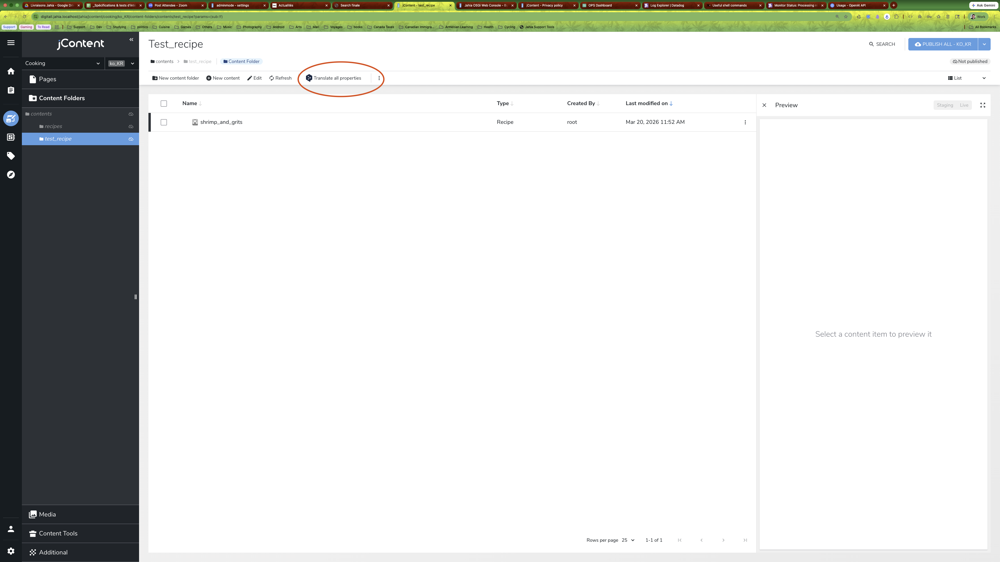

Dialog step 1:

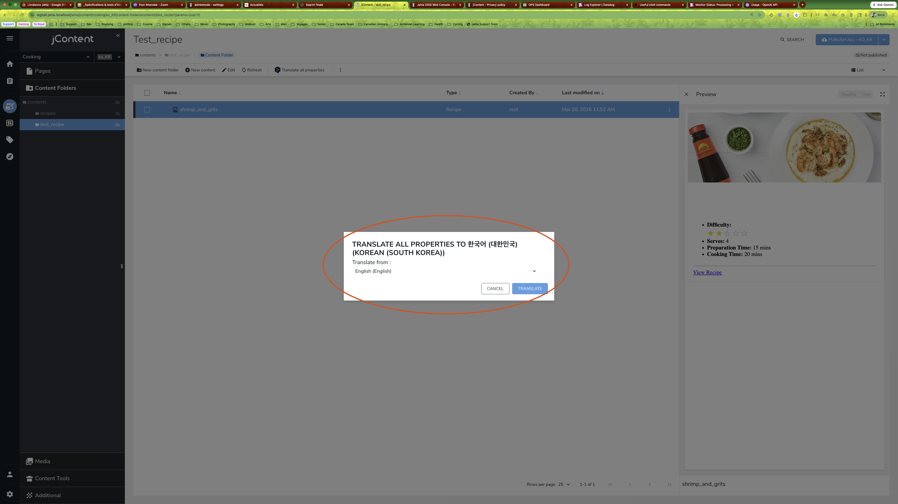

Dialog step 2 (language dropdown):

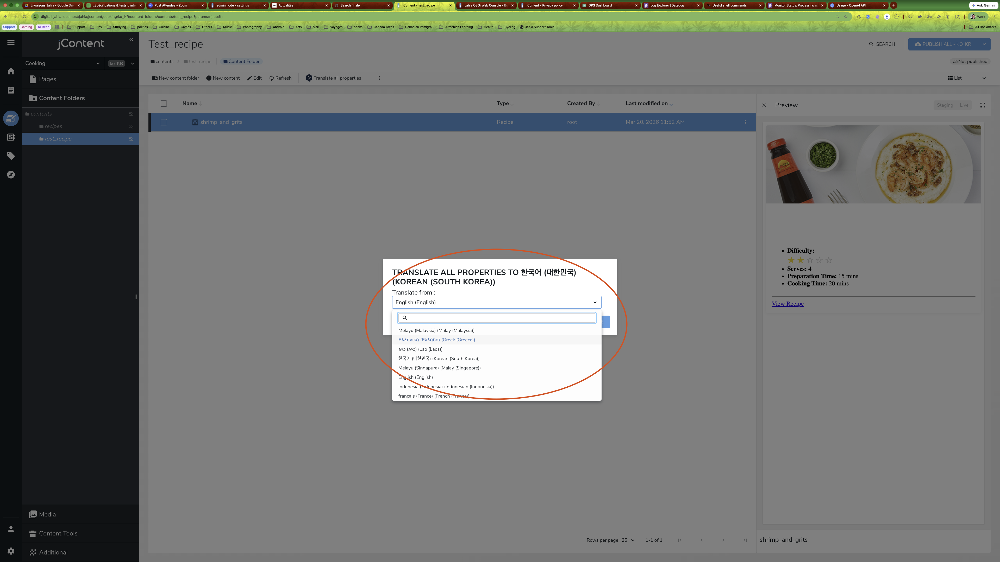

Result:

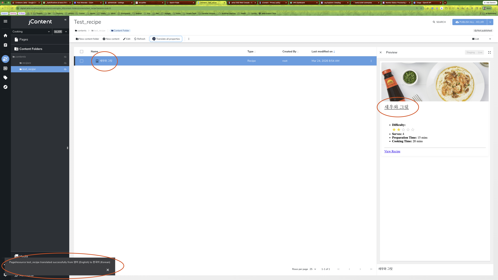

---

## Configuration

Main configuration file:

- `src/main/resources/META-INF/configurations/org.jahia.community.translation.assisted.cfg`

### Main keys

- `translation.deepl.api.key`
  - DeepL API key.
- `translation.openai.api.key`
  - OpenAI API key.
- `translation.openai.model`
  - OpenAI model used by translation requests.
- `translation.openai.prompt`
  - Base system prompt template.
  - Supports `{{sourceLanguage}}` and `{{targetLanguage}}` placeholders.
- `targetLanguages.<code>`
  - Optional mapping between Jahia language codes and provider-specific language codes.
  - Example: `targetLanguages.en=EN-US`, `targetLanguages.pt=PT-BR`.

### Glossary-related keys

- `translation.glossary.relative.path`
  - Site-relative location of glossary CSV files.
  - Default: `/settings/glossaries`.
  - Effective path is: `<site-path> + translation.glossary.relative.path`.

---

## GraphQL API

The module extends Jahia DX GraphQL types:

- `GqlJcrNode` with `translationSuggestions(...)`
- `GqlJcrNodeMutation` with:
  - `translateNode(...)`

### Query: translation suggestions

Use this to preview translated values without saving them.

```graphql
query TranslationSuggestions {
  jcr {
	nodeByPath(path: "/sites/acme/home") {
	  translationSuggestions(sourceLanguage: "en", targetLanguage: "fr") {
		fieldName
		translatedValue
	  }
	}
  }
}
```

### Mutation: translate a node

Use this to translate all translatable fields of the node (or subtree depending on provider flow).

```graphql
mutation TranslateNode {
  jcr {
	mutateNode(path: "/sites/acme/home") {
	  translateNode(sourceLocale: "en", targetLocale: "fr") {
		isSuccessful
		message
	  }
	}
  }
}
```

---

## Glossaries

Glossaries are managed as CSV files stored in Jahia (not one JCR node per term entry).

### How glossary resolution works

1. Files are loaded from the configured site folder (default `/files/glossaries`).
2. Matching CSV files are parsed and validated.
3. For a requested language pair `(source, target)`, the module builds a source->target term map.
4. That map is consumed by providers:
   - **OpenAI**: relevant glossary terms are injected in prompt context per batch.
   - **DeepL**: glossary map is pushed to DeepL glossary API and used via `glossaryId` at translation time.

### DeepL glossary management notes

- The module creates/updates multilingual DeepL glossaries from resolved CSV content.
- Glossaries are named with a module prefix and language pair.
- Stale DeepL glossaries are cleaned up periodically (based on age and cache protection).

---

## CSV format

### Required shape

- UTF-8 CSV file.
- First column must be `key`.
- At least two language columns are required.
- Language headers support formats like `en`, `fr_FR`, `el_GR`, `ms_MY`, `pt-BR`.

### Example

| key | en | fr_FR | el_GR | ms_MY | status | domain |
| --- | --- | --- | --- | --- | --- | --- |
| oyster_sauce | Lee Kum Kee Oyster Sauce | Sauce aux huitres Lee Kum Kee | Σαλτσα Στρειδιων Lee Kum Kee | Sos Tiram Lee Kum Kee | active | product |
| stir_fry | stir-fry | sauter au wok | τηγανισμα στο γουοκ | tumis | active | recipe |
| serve_hot | serve hot | servir chaud | σερβιρετε ζεστο | hidang panas | active | recipe |

### Validation rules

- `key` must be first.
- Header names must be unique.
- Empty header names are rejected.
- Each non-empty row must have a non-empty `key`.
- Each non-empty row must include at least one non-empty language value.

---

## Troubleshooting

- If GraphQL returns empty suggestions, verify:
  - provider key/API key configuration
  - target language is enabled on the site
  - source node exists in source locale
- If glossaries are not applied:
  - verify glossary folder path and filename regex in cfg
  - verify CSV header/row validity
  - for DeepL, verify API key and glossary endpoint availability

---

## Future improvements
- Add support for only translating selected content in main resource screen (not all nodes under a folder)
- Add support for selecting translation provider when both are configured (currently OpenAI has priority over DeepL)
- Add support for glossary management in the UI (currently requires manual CSV file management)
- Add support for custom prompts per content type or site (currently a single prompt is used for all translations)
- Add support for batch translation of multiple nodes at once (currently one page/folder at a time)

